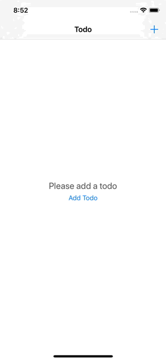

# Todo
An application to save and complete a list of things that need to be done

# Demo

# Run Project
To run the project:

* Clone this repository.
* pod install
* Open Todo.xcodeproj
* Build and run in Xcode

# License
This project is licensed under the MIT License.
